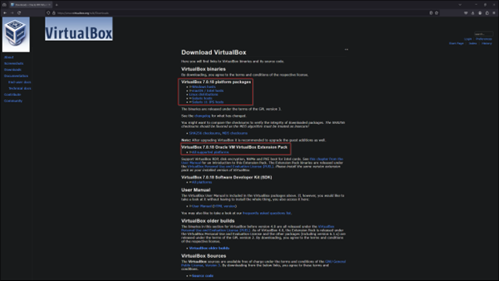

# Active-Directory

## Introduction

Setting up a home lab environment for Active Directory is an excellent way to gain hands-on experience with directory services, user management, and network configuration. This project outlines a step-by-step process to create a basic home lab running Active Directory using VirtualBox. The setup includes the installation of Windows Server 2019 as a domain controller and Windows 10 as a client machine. This guide also covers the automation of user account creation using PowerShell scripts.

## Overview

This project outlines the steps to set up a basic home lab running Active Directory using VirtualBox and to add users with PowerShell.

## Steps Covered

1. Download and install Oracle VirtualBox.
2. Download Windows 10 and Server 2019 ISOs.
3. Create and configure a domain controller virtual machine.
4. Install and configure Server 2019 and Active Directory.
5. Create and configure a client virtual machine running Windows 10.

## Step-by-Step Deployment

***Step 1: Downoad and Install VirtualBox***

- Download and install Oracle VirtualBox along with the VirtualBox Extension Pack.

***Step 2: Download ISOs***

- Download the Windows 10 ISO and Server 2019 ISO.

## 
