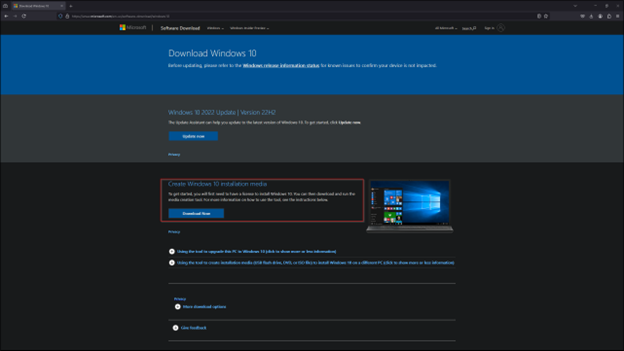
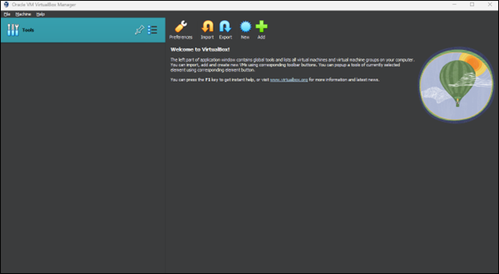

# 
 Active-Directory

## Introduction

Setting up a home lab environment for Active Directory is an excellent way to gain hands-on experience with directory services, user management, and network configuration. This project outlines a step-by-step process to create a basic home lab running Active Directory using VirtualBox. The setup includes the installation of Windows Server 2019 as a domain controller and Windows 10 as a client machine. This guide also covers the automation of user account creation using PowerShell script.

## Overview

This project outlines the steps to set up a basic home lab running Active Directory using VirtualBox and to add users with PowerShell.

## Steps Covered

1. Download and install Oracle VirtualBox.
2. Download Windows 10 and Server 2019 ISOs.
3. Create and configure a domain controller virtual machine.
4. Install and configure Server 2019 and Active Directory.
5. Create and configure a client virtual machine running Windows 10.

## Topology

## Lab Configuration

**Virtual Machine Configuration**

- *Server VM Configuration:*
  - ***Name:*** DC
  - ***Type:*** Windows
  - ***Version:*** Other Windows (64-bit)
  - ***Network:*** Two adapters (NAT and internal)
- *Client VM configuration:*
  - ***Name:*** CLIENT1
  - ***Network*** Internal

**Server Configuration**

- *Install Windows Server 2019:*
  - Install *Windows Sever 2019 Standard Evaluation* (Desktop Experience)
  - Set up the administrator account
- *IP Address Configuration:*
  - ***Internal NIC:*** 172.16.0.1
  - ***Subnet Mask:*** 255.255.255.0
  - ***DNS:*** 127.0.0.1
- *Active Directory Setup:*
  - Add Active Directory Domain Services role
  - Create a new forest and domain (mydomain.com)
- *NAT and DHCP Configuration:*
  - Install and configure Routing and Remote Access for NAT
  - Set up DHCP with a scope  

## Step-by-Step Deployment

***Step 1: Downoad and Install VirtualBox***

- Download and install Oracle VirtualBox along with the VirtualBox Extension Pack.

***Step 2: Download ISOs***

- Download the Windows 10 ISO and Server 2019 ISO.

***Step 3: Create and configure a domain controller virtual machine***

- Open VirtualBox and select new

- Create the Server 2019 Virtual Machine (VM). Name the VM ***DC***. Select the type as ***Windows***. Select version ***Other Windows (64-bit)*** and select next

- Select the amount of RAM and CPU to assign to the VM

- Select ***Create a Virtual Hard Disk Now***, assign Disk Size, and select next

- Review VM summary and select Finish to create

- Select the DC virtual machine and select Settings

- Select Network and select Adapter 2. Check the box to Enable Network Adapter. Attach it to Internal Network and select OK. We are creating the domain controller now and we want to have two NICs. We want one that’s dedicated for the internet that will be running NAT (Adapter 1) and then we will have one that is dedicated for the internal VMWare network (Adapter 2).

## 
